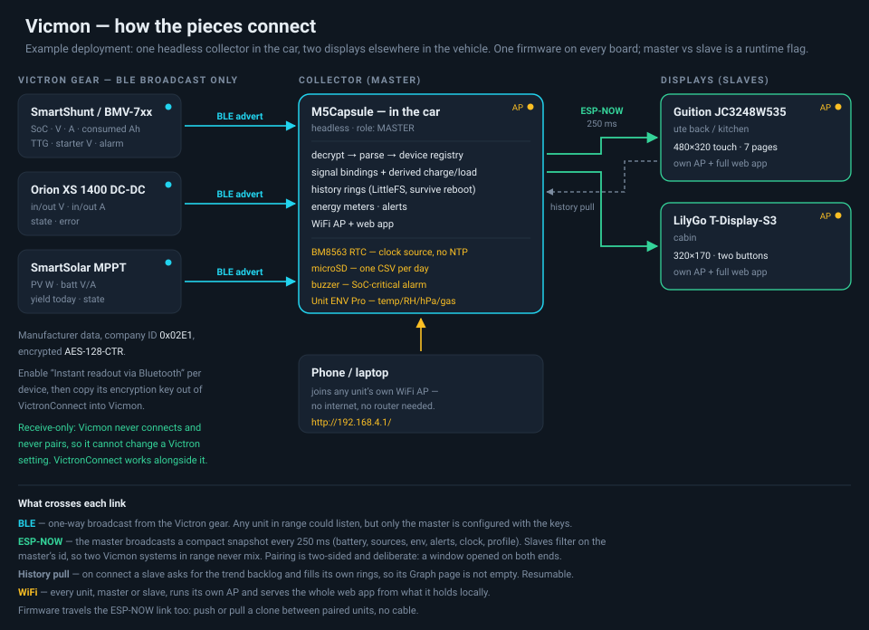

# Vicmon — Victron BLE Vehicle Monitor

A standalone ESP32 system that monitors Victron Smart Bluetooth devices (battery
monitors, DC-DC chargers, solar chargers) in a vehicle and presents them on a
live web dashboard — no Home Assistant, no internet, no Bluetooth pairing.

It reads Victron's encrypted **"Instant Readout"** BLE advertisements, decrypts
them locally with each device's key, aggregates everything, and serves a dark
**energy-flow "mimic"** UI plus a configurable signal/profile system over its own
WiFi access point.

> **Status:** running on hardware end to end. The **Guition JC3248W535** is the
> touch master (BLE + WiFi AP + web app + an on-screen dashboard), and **ESP-NOW
> slave displays** mirror it. One firmware runs on every board; master vs slave is
> a runtime NVS flag. See `PROJECT_PLAN.md` for the architecture and `PROJECT_SPEC.md`
> for the original brief.

## Documentation

| | |
|---|---|
| [docs/SETUP.md](docs/SETUP.md) | How the pieces fit together, what crosses each link, and a worked example: one collector in the car, two displays elsewhere in the vehicle. |
| [docs/HARDWARE.md](docs/HARDWARE.md) | Supported & tested hardware — which ESP32 boards and which Victron devices, and what is verified vs merely written. |
| [docs/DEPLOY.md](docs/DEPLOY.md) | Getting firmware onto a unit, including **prebuilt images that need no PlatformIO** — over the air, from a browser, or with `esptool`. |
| [PROJECT_PLAN.md](PROJECT_PLAN.md) | Architecture, decisions and the gotchas learned the hard way. |
| [PROJECT_SPEC.md](PROJECT_SPEC.md) | The original brief. |



## What works now

- Decrypts & parses Victron advertisements (BMV/SmartShunt, Orion XS DC-DC and SmartSolar MPPT all verified vs VictronConnect; AC charger parser present but unverified).
- **On-screen dashboard** (Guition touch master) — Dash, Mimic (animated energy-flow), Graph (trend), **Environment**, Week (energy meters) and Settings pages, driven directly with Arduino_GFX. Same look as the web app; a "VICMON" wordmark + charge-status banner tops the Dash/Mimic. Settings → Tune includes a **Screen flip** toggle (180° rotation for an upside-down/ceiling mount; applies live and persists).
- **Web mimic dashboard** — battery centre with SoC fill, solar/charger/DC-DC source nodes and a load, animated flow lines coloured by charge/discharge, battery detail (V, A, remaining Ah, starter V) and a **time-to-go / time-to-full** readout (days/hours; an instantaneous estimate, falling back to the BMV's own filtered TTG — charging shows time-to-full even with no battery capacity set, derived from the consumed-Ah deficit).
- **Trend chart** — server-logged history (continuous, survives client disconnects **and reboots** via LittleFS) with 1m/10m/1h/12h/24h windows and per-window scale marks (fine 5 s/1 h + coarse 60 s/24 h buffers). SoC overlaid on a right-hand 0–100 % axis; toggle each series in the legend. **On a slave** the trend is pulled from the master over ESP-NOW on connect (resumable, with a progress %) then extended live.
- **Environment sensing** — plug an **M5Stack Unit ENV Pro** (Bosch BME688) into the M5Capsule's Grove port and the monitor also tracks cabin **temperature, humidity, barometric pressure and gas resistance**. It joins every existing path: the history rings (so it persists across reboots), an **Environment card** on the web dashboard, an **Environment page** on both LCDs, four extra columns in the microSD CSV, and the ESP-NOW snapshot — so a **slave display shows the master's sensor**, backlog and all. Each pair of channels shares a chart but not an axis (temperature+humidity, pressure+gas), both auto-scaled, because indoor humidity moves within a few percent and pressure within a few hPa — a nominal 0–100 % or 300–1100 hPa axis would flatten them to a straight line. The raw gas resistance is a *relative* VOC trend (rising = cleaner air), not a calibrated index: Bosch's IAQ/eCO₂ figure needs their closed-source BSEC2 blob, which is a poor trade on a no-PSRAM board.
- **Energy meters** — resettable **Today / Trip / Total** meters showing **net-in / net-out amp-hours**, per-source Ah and duration, plus a runtime-day energy bar chart. **No clock required** — "days" advance off a persisted run-time odometer; set the clock in **Settings → Date & time** (full D/M/Y + H:M, or the browser's clock via **Now**) or via NTP to switch to calendar days. A **live clock shows in the web header** on every page. The master snapshots the clock to NVS every minute so a rough time survives reboots, and **broadcasts it to slaves**; on the **M5Capsule** it's kept in the RTC. Reset per-meter (long-press a card on the TFT, or a button on the AP). Persisted in NVS.
- **Alerts** — configurable low/critical SoC and low/high voltage thresholds plus device-offline detection; shown as a mimic banner and on the onboard RGB LED (red/amber/green), plus a **buzzer on the M5Capsule** while SoC-critical (silent while the battery is charging — the visual alert stays).
- **Config backup/restore** — download all profiles (devices, keys, bindings, settings) as JSON and restore from one; protects keys against erase/reflash and clones a second unit.
- **Simulator build** (`atoms3-sim`) — synthetic battery/solar/DC-DC so the whole UI can be developed without any Victron device.
- **Devices** — add / edit / delete by AES key; live per-device summary; "Discovered nearby" list (with Bluetooth name, MAC, RSSI) to adopt new devices.
- **Signals** — bind logical panel signals (battery SoC/V/A, solar, charger, DC-DC, load) to device fields, including **derived** charge/load from the energy balance (smoothed "assume-zero-until-stable" so out-of-step device adverts don't flicker it).
- **Profiles** — multiple independent setups (e.g. Home vs 4WD), switched instantly.
- **Diagnostics** — `/diag` page shows a live **System memory** card (free heap, largest block, min-ever low-water, uptime) plus each device's decoded fields and the raw decrypted advertisement bytes, for verifying parsers against VictronConnect. Serial console adds `mem` / `tasks` / `webtest` (which also dumps the `/api/panel` and `/api/history` JSON — the only practical way to check them on a headless board), plus `cap` / `beep` / `sd` / `env` / `led` on the M5Capsule. `env` scans the Grove port and prints the live reading; `led` cycles the RGB LED through full-brightness colours, since the normal status colours are deliberately dim.
- **OTA updates** — flash a new `firmware.bin` over WiFi from the Settings page, or **clone firmware wirelessly** between a master and its paired slave over ESP-NOW. Either **push** (from the unit that has the new firmware) or **pull** (from the out-of-date unit — it only fetches an image the peer confirms is *newer*, compared by embedded build timestamp). Trigger it from the web (Settings → System) **or the touchscreen** (Diag → Firmware), which also shows each unit's version. The target reboots into the new image only if the whole thing validates (embedded SHA-256), so an interrupted transfer is harmless. Push is gated by a per-device *allow remote update* toggle.
- **WiFi** — always runs its AP (name + password settable and persisted); can also join an existing network, reachable at `vicmon.local` (mDNS is started only when joined to a network, to save RAM in the AP-only case).
- Config persists in NVS (survives reboot **and** reflash).

## Hardware

- **Displays:** Guition JC3248W535 (3.5" 480×320 capacitive touch, ESP32-S3 + PSRAM) and LilyGo T-Display-S3 (1.9" 320×170, two buttons) — both fully supported; the panel wired to the board is detected at boot.
- **M5Stack M5Capsule** (StampS3, headless) — a compact node whose extras the firmware uses directly: its **BM8563 RTC** as the clock source (no NTP needed), a **buzzer** low-battery alarm (sounds while SoC-critical, and goes quiet while charging), a **microSD** card for long-history CSV logging (one file per day), and its **side button + RGB LED** — a short press opens/closes the ESP-NOW pairing window and the LED flashes amber while it's open. Stays powered off its internal battery via the power-hold pin. *On a Capsule v1.1 (Stamp-S3A) the RGB LED sits behind a power switch on GPIO38, which the firmware drives high at boot — without it the LED is unpowered and silently ignores everything.*
- **M5Stack Unit ENV Pro** (Bosch BME688, I²C 0x77) — optional environment sensor on the Capsule's Grove **Port A**. Sampled in forced mode without blocking the main loop.
- **Other headless nodes:** any ESP32-S3 (bare dev board, M5Stack AtomS3, …). The same firmware runs as a master (BLE + AP) or a screenless slave, chosen at runtime.
- Any Victron device with **"Instant readout via Bluetooth" enabled** in VictronConnect — **SmartShunt/BMV**, **Orion XS DC-DC** and **SmartSolar MPPT** are verified against VictronConnect; the AC-charger parser is written but untested.

Full support matrix, per board and per Victron device, with what is verified vs unproven: **[docs/HARDWARE.md](docs/HARDWARE.md)**.

## Quick start

PlatformIO is used via a project virtualenv (`.piovenv/`, git-ignored):

```bash
python3 -m venv .piovenv && .piovenv/bin/pip install platformio   # first time

# host unit tests (decrypt/parse) — no hardware needed
.piovenv/bin/pio test -e native

# build + flash — ONE universal image for every ESP32-S3 board (Guition, LilyGo, M5Capsule, AtomS3, bare S3)
.piovenv/bin/pio run -e s3 -t upload --upload-port /dev/ttyACM0

# read the serial log (pio's own monitor needs an interactive TTY)
.piovenv/bin/python tools/monitor.py --port /dev/ttyACM0 --seconds 20
```

No PlatformIO? Grab a release and flash the prebuilt image with `esptool` or straight
from a browser — or, if the unit is already running, upload it over WiFi or clone it
from another unit with no cable at all. See **[docs/DEPLOY.md](docs/DEPLOY.md)**.
`./tools/release.sh` builds the release artefacts.

One app (`src/master/`, split into `main`/`web`/`display`/`espnow`/`ble_ingest`
behind `app.h`) runs on every board, with the **master/slave role chosen at
runtime** (NVS flag — switch it from the screen, the AP web page, or serial
`role`). A single **universal `s3` image** covers all ESP32-S3 boards: the display
driver + OPI PSRAM are compiled in and used only where the hardware is present, so
a Guition brings up the dashboard and any other S3 (e.g. an AtomS3) runs headless
from the *same* binary. Other envs: `atoms3-sim` (synthetic data, no hardware),
`guition`/`gfxref`/`lvglref` (bench/reference), `native` (host tests), `wroom` (the
Phase-1 scanner in `src/wroom/`, classic ESP32).

**Slaves (ESP-NOW):** a slave receives the master's ~4/s broadcast and shows it on
its screen (or serial, if headless) plus its own config AP, which serves the **same
web app** as a master (Mimic + Stats + trend), sourced from the received frame. The
role-only surfaces are hidden: the nav drops Devices/Diag and the Settings page
shows just the slave's own controls (pair / switch role, config AP, OTA). Pairing is
two-sided: open the master's 60 s window (Diag/Tune *Pair*, or web/serial `pair`),
then adopt on the slave (button / web / serial). A paired slave filters to its
master's id, so several masters can coexist.

## Using it

1. Power the master. It starts a WiFi AP **`Vicmon-<id>`** (e.g. `Vicmon-858428`; password `vicmon1234` — both changeable on the AP and persisted).
2. Join that network and open **`http://192.168.4.1/`** (a captive-portal prompt usually pops up).
3. Go to **Settings → Profiles**, create/name a profile (e.g. "4WD").
4. Go to **Devices → Add device**: enter a name, type, and the 32-hex **encryption key**.
   - Get the key from **VictronConnect → the device → ⚙ → Product info →
     Encryption data**. A key only ever decrypts its own device, so there's no
     ambiguity about which device it belongs to.
   - Or use **Discovered nearby** to see Victron devices in range (name/MAC/RSSI)
     and pre-fill the form.
5. The **Mimic** comes alive as devices are heard. Tune **Settings → System
   settings** (battery capacity for remaining-Ah and time-to-full; idle deadband).

## How it works (short version)

Victron broadcasts AES-128-CTR-encrypted advertisements (company id `0x02E1`).
The master listens (active scan), decrypts each with the matching device key,
parses the bit-packed record, and stores the latest values per device. A
**signal-binding** layer maps those device fields onto logical panel signals the
UI consumes via `GET /api/panel`; a ring buffer feeds `GET /api/history`. The
container/decryption details and the full module architecture are documented in
`PROJECT_PLAN.md`.

## Notes

- **No data without a key.** Only the advertisement *header* (model id, name,
  MAC, signal strength) is cleartext; all readings are AES-encrypted.
- **Config survives reflash** — only a deliberate `pio run -t erase` clears NVS.
- **Matching is by key, not MAC** — robust against Victron's rotating addresses.

## Credits / references

- Victron "Extra Manufacturer Data" specification (advertisement format)
- [`keshavdv/victron-ble`](https://github.com/keshavdv/victron-ble) — Python reference
- [`wytr/VictronSolarDisplayEsp`](https://github.com/wytr/VictronSolarDisplayEsp) — ESP reference
- AES from the public-domain [`kokke/tiny-AES-c`](https://github.com/kokke/tiny-AES-c)
