# Vicmon — a battery monitor screen for Victron gear

**See your Victron battery, solar and DC-DC charger at a glance, on a small touch
screen in your 4WD, van or boat. No internet, no app to keep open and no subscription.**

If you have Victron gear with Bluetooth (a SmartShunt, BMV, Orion XS, SmartSolar…),
VictronConnect can already show you the numbers, but only while your phone is out and
the app is open. Vicmon is a cheap ESP32 screen that sits on your dash or wall and
shows them all the time. It listens to the same Bluetooth broadcasts VictronConnect
uses, so nothing needs rewiring and nothing is changed on your Victron devices.

<table>
<tr>
<td width="62%">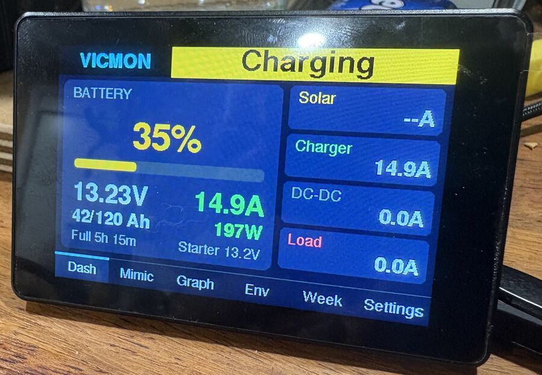</td>
<td width="38%">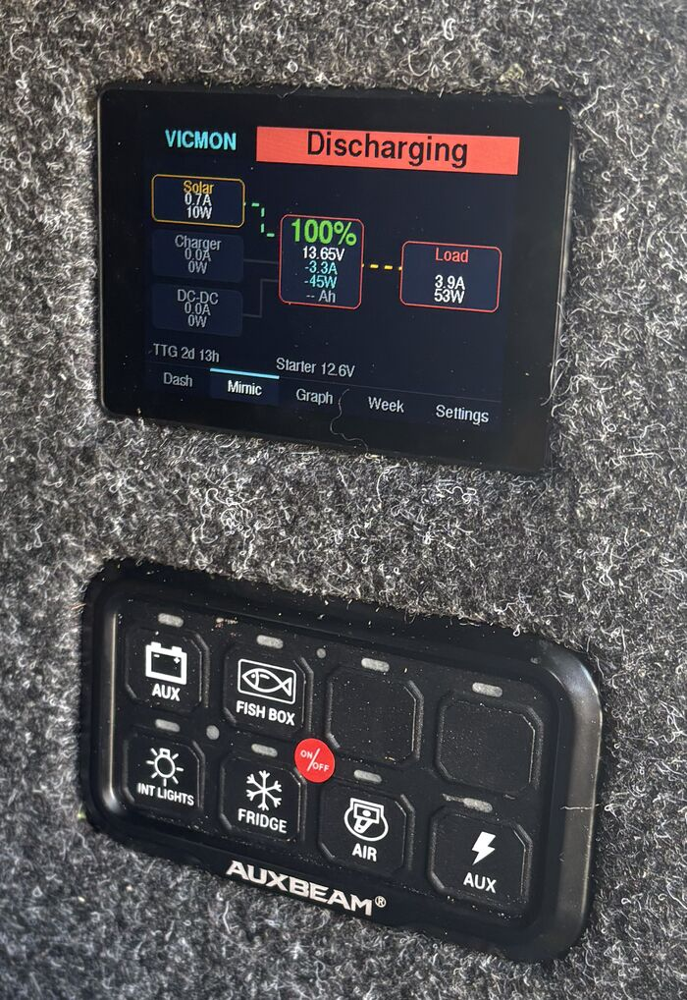</td>
</tr>
<tr>
<td align="center">On the bench: the Dash page, charging</td>
<td align="center">Installed in a 4WD canopy</td>
</tr>
</table>

## What you get

- **Battery at a glance.** State of charge, voltage, current, amp-hours left, and how
  long until the battery is full (or flat).
- **Where the power is going.** An animated diagram shows solar, charger and DC-DC
  flowing into the battery and out to your loads.
- **History graphs** covering the last minute to the last 24 hours, kept even when
  the power goes off.
- **Daily energy totals.** How much went in and out today, this trip, and in total.
- **Cabin temperature, humidity and air pressure** if you add the optional sensor.
- **Alarms** for low battery, low or high voltage, or a device dropping out, shown
  on screen and on the status light. There's a buzzer on the M5Capsule board.
- **A web dashboard on your phone.** Vicmon makes its own WiFi hotspot, so any phone
  or laptop can open the full dashboard and settings, with no internet needed.
- **More screens if you want them.** Put extra displays anywhere in the vehicle and
  they mirror the main one wirelessly.

### The screens

| | |
|---|---|
| 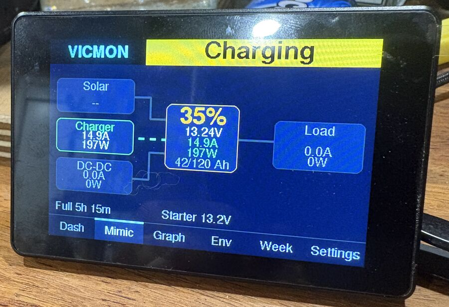 | 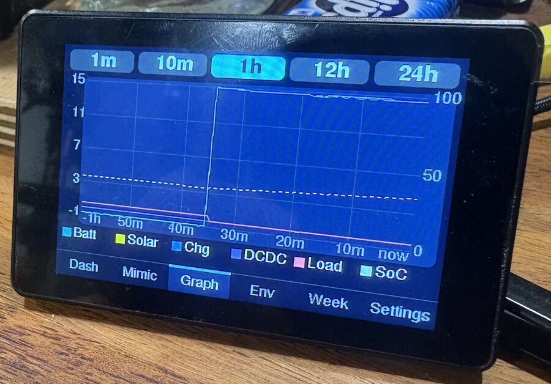 |
| **Mimic** — where the energy is flowing right now | **Graph** — the last 1 minute to 24 hours |
| 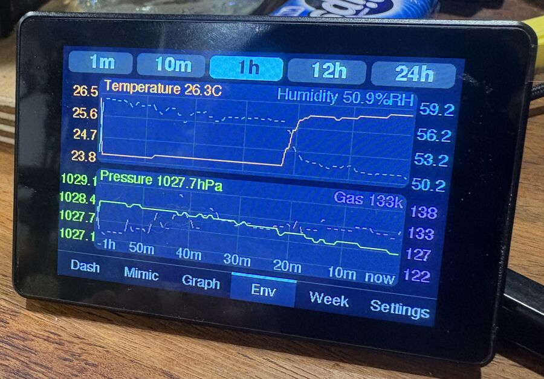 | 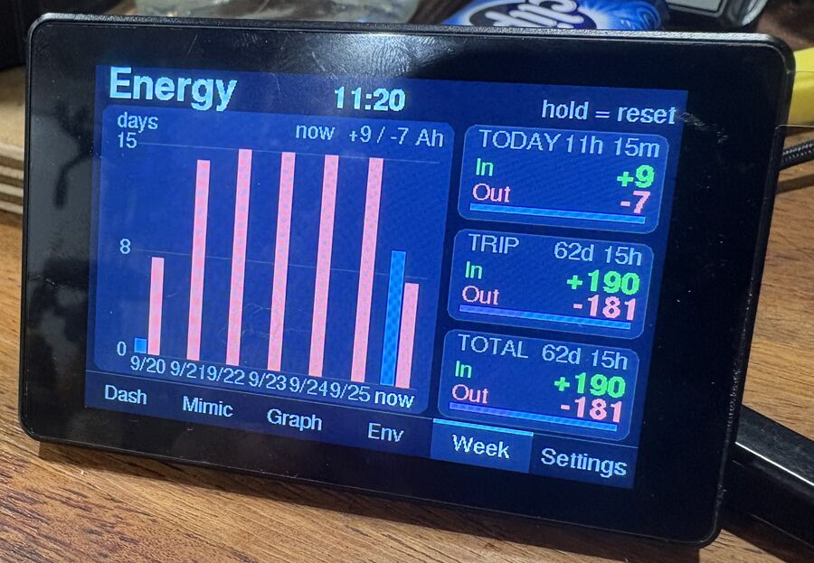 |
| **Env** — cabin temperature, humidity and pressure | **Week** — daily energy in and out |

### The web dashboard

The same data in a browser, from any phone or laptop on Vicmon's WiFi. This is also
where you set everything up. Click a picture to see it full size.

<table>
<tr>
<td width="33%"><a href="docs/img/web-mimic.jpg">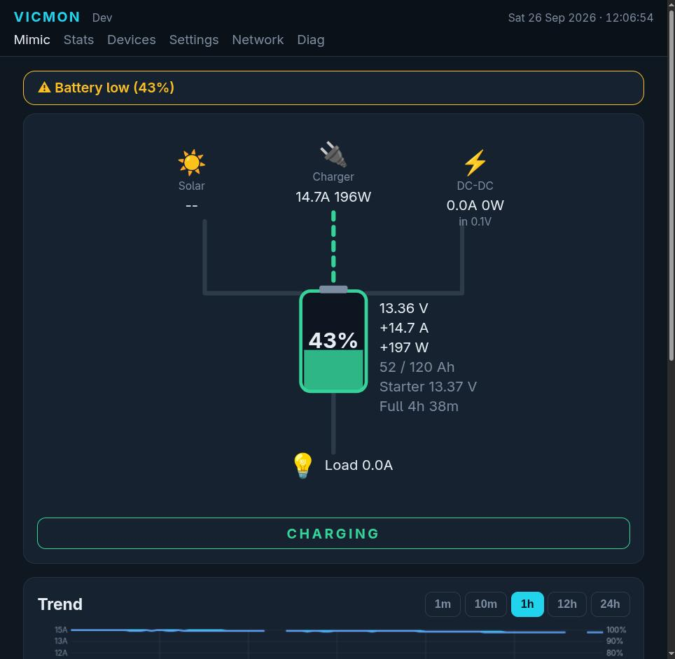</a></td>
<td width="33%"><a href="docs/img/web-mimic-graphs.jpg">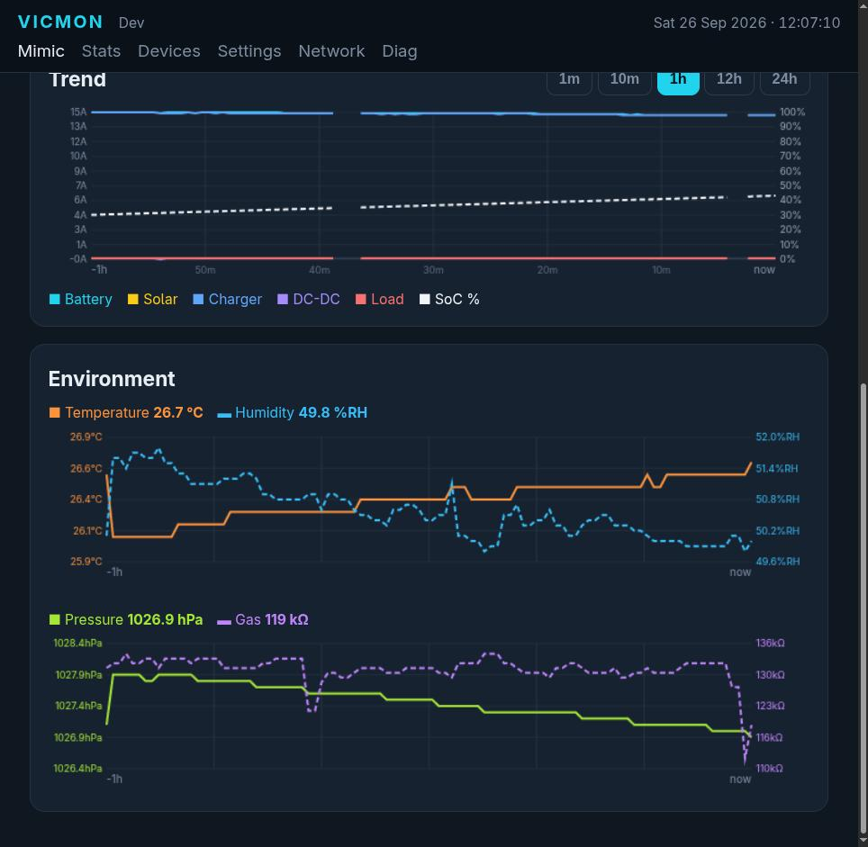</a></td>
<td width="33%"><a href="docs/img/web-stats.jpg">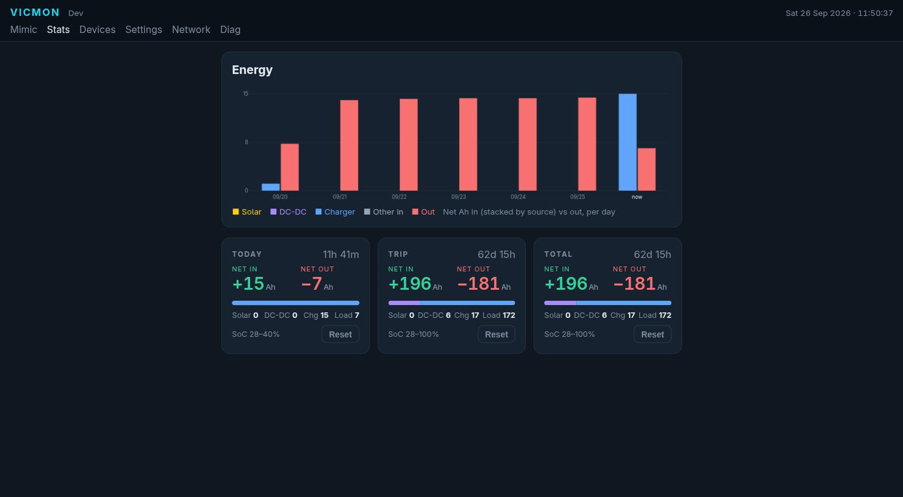</a></td>
</tr>
<tr>
<td align="center"><b>Mimic</b>: live energy flow</td>
<td align="center"><b>Graphs</b>: trend and environment</td>
<td align="center"><b>Stats</b>: energy meters and the last 7 days</td>
</tr>
<tr>
<td><a href="docs/img/web-devices.jpg">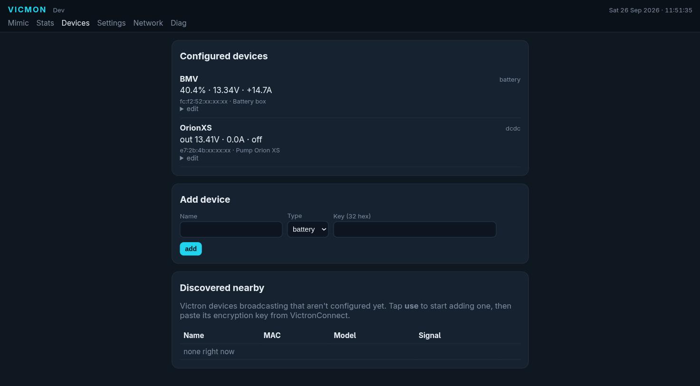</a></td>
<td><a href="docs/img/web-settings.jpg">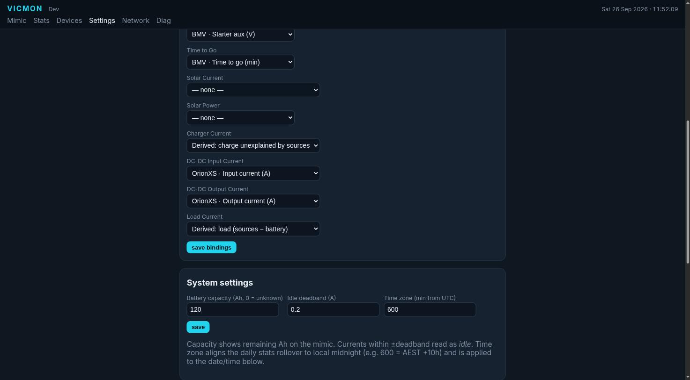</a></td>
<td><a href="docs/img/web-network.jpg">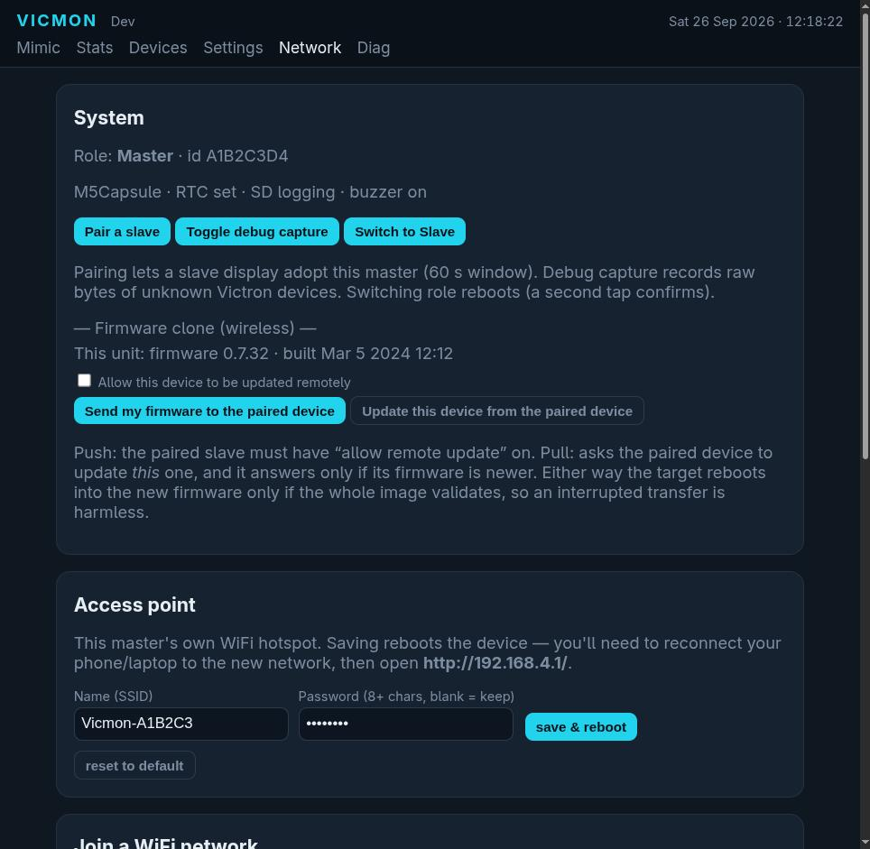</a></td>
</tr>
<tr>
<td align="center"><b>Devices</b>: add your Victron gear</td>
<td align="center"><b>Settings</b>: battery size and what feeds each reading</td>
<td align="center"><b>Network</b>: WiFi, pairing and updates</td>
</tr>
</table>

## What you need

1. **Victron gear with Bluetooth "Instant readout".** Any of these work:

   | Victron device | What Vicmon shows | Status |
   |---|---|---|
   | [SmartShunt](https://www.victronenergy.com/battery-monitors/smart-battery-shunt) or [BMV-712 Smart](https://www.victronenergy.com/battery-monitors/bmv-712-smart) battery monitor | State of charge, voltage, current, Ah used, time to go, starter battery | ✅ tested |
   | [Orion XS](https://www.victronenergy.com/dc-dc-converters/orion-xs-dc-dc-battery-chargers) DC-DC charger | Input and output voltage and current, charging state | ✅ tested |
   | [SmartSolar MPPT](https://www.victronenergy.com/solar-charge-controllers) solar charger | Solar power, charge current, yield today, charging state | ✅ tested |
   | Blue Smart AC charger | Charging state, voltage, current | ⚠️ should work, not yet tested |

2. **A board to run it on.** The Guition is the one to get if you want a screen:

   | Board | What it's like | Good for |
   |---|---|---|
   | <br>**[Guition JC3248W535](https://www.guition.com/esp32-display-module/3-5-inch-esp32s3-display-module)** ⭐ | 3.5" colour touch screen with the ESP32 built in. Usually about US$11–18 online; search for "JC3248W535", and get the **C** (capacitive touch) version. [Buyer's notes](https://www.atomic14.com/esp32/boards/guition-jc3248w535/). | The main screen: the photos above |
   | **[LilyGo T-Display-S3](https://lilygo.cc/en-us/products/t-display-s3)** | Small 1.9" screen with two buttons | A compact second display |
   | **[M5Stack M5Capsule](https://shop.m5stack.com/products/m5stack-capsule-kit-v1-1-with-m5stamps3a)** | No screen. Small box with a clock, buzzer, microSD logging and battery | A hidden collector near the batteries, with a low-battery alarm |
   | **[M5Stack AtomS3 Lite](https://shop.m5stack.com/products/atoms3-lite-esp32s3-dev-kit)** | No screen. Tiny (24 mm square) | A cheap hidden collector |
   | Any other ESP32-S3 board | No screen | Tinkering |

   Optional: the **[M5Stack ENV Pro sensor](https://shop.m5stack.com/products/env-pro-unit-with-temperature-humidity-pressure-and-gas-sensor-bme688)**
   plugs into the M5Capsule to add cabin temperature, humidity and pressure.
   The full details are in [docs/HARDWARE.md](docs/HARDWARE.md).

3. **A USB-C cable and a computer with Chrome or Edge,** once, to load the software.
4. **The [VictronConnect app](https://www.victronenergy.com/victronconnectapp) on your phone,** once, to copy each device's key.

## Getting started

**1. Load the software.** Download `vicmon-…-esp32s3-full.bin` from the
[latest release](https://github.com/tech-wit/vicmon/releases/latest). Plug the board
into your computer, open [esptool-js](https://espressif.github.io/esptool-js/) in
Chrome or Edge, click **Connect**, add the file at address `0x0` and click **Program**.
There's nothing to install. The same file works on every supported board.
([Other ways to install and update](docs/DEPLOY.md).)

**2. Turn on Instant readout.** In VictronConnect, open each device, tap ⚙ →
**Product info**, switch on **Instant readout via Bluetooth**, and note the
**encryption key** under *Encryption data* (32 letters and numbers).

**3. Connect to Vicmon.** Power the board. On your phone, join the WiFi network
**`Vicmon-…`** (password `vicmon1234`), and the setup page should pop up. If it
doesn't, open **http://192.168.4.1/** in a browser.

> 🔒 **Change the WiFi password straight away**, in **Network → Access point**.
> The default is the same on every Vicmon, so anyone nearby could otherwise join yours.

**4. Add your devices.** Go to **Devices**. Your Victron devices appear under
**Discovered nearby**. Tap **use**, paste in the key from step 2, and save. Each key
only unlocks its own device, so you can't mix them up.

**5. Tell it about your battery.** In **Settings**, enter your battery's capacity in
amp-hours so it can show amp-hours left and time to full.

That's it: the screen comes alive within a few seconds of each device being added.
Your settings survive power cuts and software updates.

**Want more screens?** Any extra board can mirror the first one wirelessly. Tap
*Pair* on the main unit, then accept on the new one. See
[docs/SETUP.md](docs/SETUP.md) for a worked example with a unit in the car and two
displays elsewhere.

## Documentation

| | |
|---|---|
| [docs/SETUP.md](docs/SETUP.md) | How the pieces fit together, with a worked example: one collector in the car and two displays elsewhere in the vehicle. |
| [docs/HARDWARE.md](docs/HARDWARE.md) | Supported and tested hardware: which ESP32 boards and which Victron devices, and what's verified versus only written. |
| [docs/DEPLOY.md](docs/DEPLOY.md) | Getting firmware onto a unit, including **prebuilt images that need no PlatformIO**: over the air, from a browser, or with `esptool`. |
| [PROJECT_PLAN.md](PROJECT_PLAN.md) | Architecture, decisions and the gotchas learned the hard way. |
| [docs/CREDITS.md](docs/CREDITS.md) | Protocol references, vendored code, every linked library, and what was used but not shipped. |
| [PROJECT_SPEC.md](PROJECT_SPEC.md) | The original brief. |

## Good to know

- **It only reads; it never changes anything on your Victron gear.** It passively
  listens to Bluetooth broadcasts. There's no pairing and no connection.
- **Without a device's key it sees nothing useful.** Victron encrypts the readings;
  only the device's name and model are public.
- **Back up your settings.** Network → Backup & restore downloads everything,
  including the keys, as one file. Use it to restore after a full re-flash or to set
  up a second unit identically.
- **Multiple setups:** profiles let one box switch between, say, the 4WD and home.

---

## Full feature list

<details>
<summary>Everything the firmware does, in detail</summary>

- Decrypts and parses Victron advertisements. BMV/SmartShunt, Orion XS DC-DC and SmartSolar MPPT are all verified against VictronConnect; the AC charger parser is present but unverified.
- **On-screen dashboard** (Guition touch master): Dash, Mimic (animated energy flow), Graph (trend), **Environment**, Week (energy meters) and Settings pages, driven directly with Arduino_GFX. It has the same look as the web app, with a "VICMON" wordmark and charge-status banner on the Dash and Mimic. Settings → Tune includes a **Screen flip** toggle (180° rotation for an upside-down or ceiling mount; applies live and persists).
- **Web mimic dashboard:** battery centre with SoC fill, solar/charger/DC-DC source nodes and a load, animated flow lines coloured by charge/discharge, battery detail (V, A, remaining Ah, starter V) and a **time-to-go / time-to-full** readout in days/hours. This is an instantaneous estimate, falling back to the BMV's own filtered TTG. When charging it shows time-to-full even with no battery capacity set, derived from the consumed-Ah deficit.
- **Trend chart:** server-logged history with 1m/10m/1h/12h/24h windows and per-window scale marks (fine 5 s/1 h plus coarse 60 s/24 h buffers). It's continuous and survives client disconnects **and reboots** via LittleFS. SoC is overlaid on a right-hand 0–100 % axis, and each series can be toggled in the legend. **On a slave** the trend is pulled from the master over ESP-NOW on connect (resumable, with a progress %) and then extended live.
- **Environment sensing:** plug an **M5Stack Unit ENV Pro** (Bosch BME688) into the M5Capsule's Grove port and the monitor also tracks cabin **temperature, humidity, barometric pressure and gas resistance**. These join every existing path: the history rings (so they persist across reboots), an **Environment card** on the web dashboard, an **Environment page** on both LCDs, four extra columns in the microSD CSV, and the ESP-NOW snapshot, so a **slave display shows the master's sensor**, backlog and all.
  - Each pair of channels (temperature+humidity, pressure+gas) shares a chart but not an axis, and both axes auto-scale. Indoor humidity moves within a few percent and pressure within a few hPa, so a fixed 0–100 % or 300–1100 hPa axis would flatten them to a straight line.
  - The raw gas resistance is a *relative* VOC trend (rising = cleaner air), not a calibrated index. Bosch's IAQ/eCO₂ figure needs their closed-source BSEC2 blob, which is a poor trade on a board with no PSRAM.
- **Energy meters:** resettable **Today / Trip / Total** meters showing **net-in / net-out amp-hours**, per-source Ah and duration, plus a runtime-day energy bar chart.
  - **No clock is required:** "days" advance off a persisted run-time odometer. To switch to calendar days, set the clock in **Settings → Date & time** (full D/M/Y + H:M, or the browser's clock via **Now**) or use NTP.
  - A **live clock shows in the web header** on every page. The master saves the clock to NVS every minute, so a rough time survives reboots, and **broadcasts it to slaves**. On the **M5Capsule** it's kept in the RTC.
  - Reset each meter separately: long-press its card on the TFT, or use a button on the AP. Meters persist in NVS.
- **Alerts:** configurable low/critical SoC and low/high voltage thresholds plus device-offline detection. They show as a mimic banner and on the onboard RGB LED (red/amber/green). On the **M5Capsule** a buzzer also sounds while SoC is critical, but stays silent while the battery is charging; the visual alert remains.
- **Config backup/restore:** download all profiles (devices, keys, bindings, settings) as JSON and restore from it. This protects keys against erase/reflash and clones a second unit.
- **Simulator build** (`atoms3-sim`): synthetic battery/solar/DC-DC data, so the whole UI can be developed without any Victron device.
- **Devices:** add, edit or delete by AES key, with a live per-device summary. A "Discovered nearby" list (Bluetooth name, MAC, RSSI) lets you adopt new devices.
- **Signals:** bind logical panel signals (battery SoC/V/A, solar, charger, DC-DC, load) to device fields, including **derived** charge/load from the energy balance. Derived values are smoothed ("assume zero until stable") so out-of-step device adverts don't make them flicker.
- **Profiles:** multiple independent setups (e.g. Home vs 4WD), switched instantly.
- **Diagnostics:** the `/diag` page shows a live **System memory** card (free heap, largest block, lowest-ever free, uptime) plus each device's decoded fields and the raw decrypted advertisement bytes, for checking parsers against VictronConnect.
  - The serial console adds `mem`, `tasks` and `webtest`. `webtest` also dumps the `/api/panel` and `/api/history` JSON, the only practical way to check them on a headless board.
  - On the M5Capsule there are also `cap`, `beep`, `sd`, `env` and `led`. `env` scans the Grove port and prints the live reading. `led` cycles the RGB LED through full-brightness colours, since the normal status colours are deliberately dim.
- **OTA updates:** flash a new `firmware.bin` over WiFi from the Settings page, or **clone firmware wirelessly** between a master and its paired slave over ESP-NOW.
  - You can **push** from the unit that has the new firmware, or **pull** from the out-of-date unit. A pull only fetches an image the peer confirms is *newer*, compared by embedded build timestamp.
  - Trigger it from the web (Settings → System) **or the touchscreen** (Diag → Firmware), which also shows each unit's version.
  - The target only reboots into the new image if the whole thing validates against its embedded SHA-256, so an interrupted transfer is harmless. Push is gated by a per-device *allow remote update* toggle.
- **WiFi:** the AP always runs, with a name and password you can set and that persist. The unit can also join an existing network, where it's reachable at `vicmon.local`. mDNS only starts when joined to a network, to save RAM in the AP-only case.
- Config persists in NVS, surviving both reboots **and** reflashes.

</details>

## Hardware details

- **Displays:** Guition JC3248W535 (3.5" 480×320 capacitive touch, ESP32-S3 + PSRAM) and LilyGo T-Display-S3 (1.9" 320×170, two buttons). Both are fully supported, and the firmware detects at boot which panel is wired to the board.
- **M5Stack M5Capsule** (StampS3, headless): a compact node whose extras the firmware uses directly:
  - its **BM8563 RTC** as the clock source, so no NTP is needed;
  - a **buzzer** low-battery alarm, which sounds while SoC is critical and goes quiet while charging;
  - a **microSD** card for long-history CSV logging, one file per day;
  - its **side button + RGB LED**: a short press opens or closes the ESP-NOW pairing window, and the LED flashes amber while it's open.

  It stays powered off its internal battery via the power-hold pin. *On a Capsule v1.1 (Stamp-S3A) the RGB LED sits behind a power switch on GPIO38, which the firmware drives high at boot. Without that, the LED is unpowered and silently ignores everything.*
- **M5Stack Unit ENV Pro** (Bosch BME688, I²C 0x77): an optional environment sensor on the Capsule's Grove **Port A**. It's sampled in forced mode without blocking the main loop.
- **Other headless nodes:** any ESP32-S3 (bare dev board, M5Stack AtomS3, …). The same firmware runs as a master (BLE + AP) or a screenless slave, chosen at runtime.
- Any Victron device with **"Instant readout via Bluetooth" enabled** in VictronConnect. **SmartShunt/BMV**, **Orion XS DC-DC** and **SmartSolar MPPT** are verified against VictronConnect; the AC-charger parser is written but untested.

Full support matrix, per board and per Victron device, with what is verified and what is unproven: **[docs/HARDWARE.md](docs/HARDWARE.md)**.

## For developers

**Status:** running end to end on hardware. The **Guition JC3248W535** is the touch
master (BLE + WiFi AP + web app + an on-screen dashboard), and **ESP-NOW slave
displays** mirror it. One firmware runs on every board; master vs slave is a
runtime NVS flag. See `PROJECT_PLAN.md` for the architecture and `PROJECT_SPEC.md`
for the original brief.


### Building from source

PlatformIO is used via a project virtualenv (`.piovenv/`, git-ignored):

```bash
python3 -m venv .piovenv && .piovenv/bin/pip install platformio   # first time

# host unit tests (decrypt/parse) — no hardware needed
.piovenv/bin/pio test -e native

# build + flash — ONE universal image for every ESP32-S3 board (Guition, LilyGo, M5Capsule, AtomS3, bare S3)
.piovenv/bin/pio run -e s3 -t upload --upload-port /dev/ttyACM0

# read the serial log (pio's own monitor needs an interactive TTY)
.piovenv/bin/python tools/monitor.py --port /dev/ttyACM0 --seconds 20
```

`./tools/release.sh` builds the release artefacts; see [docs/DEPLOY.md](docs/DEPLOY.md).

### Layout

One app runs on every board, in `src/master/`, split into `main`, `web`, `display`,
`espnow` and `ble_ingest` behind `app.h`. The **master/slave role is chosen at
runtime** by an NVS flag; switch it from the screen, the AP web page, or serial
`role`.

A single **universal `s3` image** covers all ESP32-S3 boards. The display driver and
OPI PSRAM support are compiled in but used only where the hardware is present, so a
Guition brings up the dashboard and any other S3 (e.g. an AtomS3) runs headless from
the *same* binary.

Other build environments:

| Env | Purpose |
|---|---|
| `atoms3-sim` | Synthetic data, no hardware needed |
| `gfxref`, `lvglref`, `lilygoref` | Panel bring-up baselines |
| `native` | Host unit tests |
| `wroom` | The Phase-1 scanner in `src/wroom/`, for a classic ESP32 |

### Slaves (ESP-NOW)

A slave receives the master's broadcast (about 4 per second) and shows it on its
screen, or on serial if it's headless. It also runs its own config AP, serving the
**same web app** as a master (Mimic, Stats and trend) from the received frame. The
master-only parts are hidden: the nav drops Devices and Diag, and the Settings page
shows only the slave's own controls (pair, switch role, config AP, OTA).

Pairing is two-sided:

1. Open the master's 60 s pairing window (Diag/Tune *Pair*, or web/serial `pair`).
2. Adopt the master on the slave (button, web or serial).

A paired slave filters on its master's id, so several masters can coexist.

### How it works

1. Victron devices broadcast AES-128-CTR-encrypted advertisements (company id `0x02E1`).
2. The master listens with an active scan, decrypts each advertisement with the matching device key, parses the bit-packed record, and stores the latest values per device.
3. A **signal-binding** layer maps those device fields onto logical panel signals, which the UI reads via `GET /api/panel`.
4. A ring buffer feeds `GET /api/history`.

Devices are matched by key, not MAC, so Victron's rotating addresses don't matter.
Config lives in NVS; only a deliberate `pio run -t erase` clears it. The container and
decryption details and the full module architecture are in `PROJECT_PLAN.md`.

## Development

Vicmon was developed with the help of [Claude](https://claude.ai) (Anthropic's AI
assistant), using Claude Code for design, firmware, the web UI and testing, with
all hardware work and verification done on real devices.

## License

MIT; see [LICENSE](LICENSE). Third-party components keep their own (permissive)
terms; the breakdown is in [docs/CREDITS.md](docs/CREDITS.md#licensing).

## Credits / references

This is the short list. The full one, including every linked library and what was
used but not shipped, is in **[docs/CREDITS.md](docs/CREDITS.md)**.

- Victron "Extra Manufacturer Data" specification (advertisement format)
- [`keshavdv/victron-ble`](https://github.com/keshavdv/victron-ble): Python reference
- [`wytr/VictronSolarDisplayEsp`](https://github.com/wytr/VictronSolarDisplayEsp): ESP reference
- AES from the public-domain [`kokke/tiny-AES-c`](https://github.com/kokke/tiny-AES-c)
- [`me-processware/JC3248W535-Driver`](https://github.com/me-processware/JC3248W535-Driver): Guition panel bring-up baseline
- NimBLE-Arduino, ESP32Async AsyncTCP/ESPAsyncWebServer, Arduino_GFX, ArduinoJson, Bosch BME68x
- Adafruit GFX bitmap fonts (from GNU FreeFont), used by both LCD renderers
