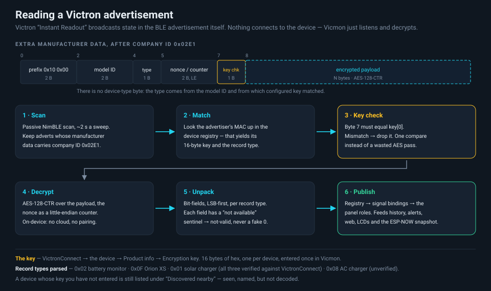

# Supported & tested hardware

What has actually been run, and what is written but unproven. "Verified" here means
run on the real device and cross-checked against VictronConnect or a known-good
reference — not "the code path exists".

## ESP32 boards

One firmware (`env:s3`) runs on every board below. The panel and peripherals are
detected at boot by `detectBoard()`, and **master vs slave is a runtime NVS flag**,
not a build option — any board can be either.

| Board | Screen | Role it is used in | Status |
|---|---|---|---|
| **[Guition JC3248W535](https://www.guition.com/esp32-display-module/3-5-inch-esp32s3-display-module)** (ESP32-S3, 16MB flash / 8MB OPI PSRAM) | 3.5" 480×320 IPS, capacitive touch | master or slave; 7-page touch dashboard | ✅ verified, in daily use |
| **[LilyGo T-Display-S3](https://lilygo.cc/en-us/products/t-display-s3)** (ESP32-S3, PSRAM) | 1.9" 320×170 ST7789, two buttons | master or slave; 7-page button dashboard | ✅ verified |
| **[M5Stack M5Capsule v1.1](https://docs.m5stack.com/en/core/Capsule_v1.1)** (Stamp-S3A, ESP32-S3FN8, **no PSRAM**) | none | headless master or slave; adds RTC, buzzer, microSD, power-hold | ✅ verified on **v1.1**. The original v1.0 (StampS3) should also work, but is untested. |
| **[M5Stack AtomS3 Lite](https://docs.m5stack.com/en/core/AtomS3%20Lite)** (ESP32-S3, no PSRAM) | none | headless master or slave | ✅ verified (the original dev master) |
| Any other **ESP32-S3** dev board | none | headless master or slave | should work — `detectBoard()` falls back to headless. Not tested board by board. |
| **ESP32 WROOM-32** (classic ESP32, not S3) | none | Phase-1 BLE scanner only (`env:wroom`) | ⚠️ **not** the universal image — no web app, no ESP-NOW, no display |

Notes that bite:

- The universal image is **ESP32-S3 only**. It is built on the 8MB partition table,
  so a 16MB board simply uses its first 8MB.
- A board **without PSRAM** runs headless: the framebuffer allocation fails and the
  boot code bails out of the panel bring-up gracefully. That is the expected path on
  the Capsule and AtomS3, not an error.
- On an **M5Capsule v1.1 (Stamp-S3A)** the RGB LED sits behind a power switch on
  GPIO38. The firmware drives it high at boot; without that the LED is unpowered and
  silently ignores every write.
- Config (device keys, profiles, bindings, pairing) lives in **NVS at a fixed offset**
  and survives a normal reflash. It does *not* survive flashing the merged full image
  — see [DEPLOY.md](DEPLOY.md).

### Peripherals

| Part | Where | Status |
|---|---|---|
| **[M5Stack Unit ENV Pro](https://docs.m5stack.com/en/unit/ENV%20Pro%20Unit)** (Bosch BME688) | M5Capsule Grove **Port A** (`Wire1`, SDA 13 / SCL 15, I²C 0x77) | ✅ verified — temperature, humidity, pressure, gas resistance |
| **microSD** | M5Capsule slot (SPI: SCK 14 / MOSI 12 / MISO 39 / CS 11) | ✅ verified — one CSV per day |
| **BM8563 RTC** | M5Capsule, I²C 0x51 (SDA 8 / SCL 10) | ✅ verified — used as the clock source instead of NTP |

The ENV Pro is **M5Capsule-only by design**: Grove Port A pins differ per M5 board,
and the firmware hard-codes the Capsule's.

## Victron devices

Vicmon reads Victron's **"Instant Readout"** BLE advertisements. For each device you
need to enable *Instant readout via Bluetooth* in VictronConnect and copy out its
**encryption key** (VictronConnect → the device → Product info → Encryption key).

**What should be compatible:** in practice, Victron's **"Smart"** range: the
models with Bluetooth built in (SmartSolar, SmartShunt, BMV-712 Smart, Orion XS,
Blue Smart chargers, Phoenix Smart…). If VictronConnect offers an *Instant readout*
toggle for a device, its data reaches Vicmon.

Whether Vicmon can *decode* the data depends on the device's **record type**, as the
table below shows. Only the devices marked verified have been tested. Other Smart
models that share a verified record type (e.g. other SmartSolar sizes) should work
as they are. A model whose record type isn't parsed yet needs a parser added before
its readings appear. Until then it still shows up under **Discovered nearby**.

Devices **without built-in Bluetooth** (BlueSolar MPPT, BMV-700/702) never broadcast
Instant Readout, so they can't work. As far as we know, adding a VE.Direct Bluetooth
Smart dongle doesn't change that.

| Device | Record | Fields Vicmon decodes | Status |
|---|---|---|---|
| **[SmartShunt](https://www.victronenergy.com/battery-monitors/smart-battery-shunt) / [BMV-7xx](https://www.victronenergy.com/battery-monitors/bmv-712-smart)** battery monitor | `0x02` | SoC, voltage, current, consumed Ah, time-to-go, aux (starter V / midpoint / temperature), alarm bits | ✅ verified against VictronConnect |
| **[Orion XS 1400](https://www.victronenergy.com/dc-dc-converters/orion-xs-dc-dc-battery-chargers)** DC-DC charger | `0x0F` | input/output voltage, input/output current, device state, charger error | ✅ verified against VictronConnect |
| **[SmartSolar MPPT](https://www.victronenergy.com/solar-charge-controllers)** solar charger | `0x01` | PV power, battery V/A, yield today, load current, device state, charger error | ✅ verified against VictronConnect |
| **Blue Smart AC charger** (IP22/IP65 class) | `0x08` | device state, charger error, battery V/A | ⚠️ **parser written, never tested** — no AC charger on hand. The `/diag` page makes confirming it a 5-minute job for anyone who has one. |
| Phoenix Inverter (`0x03`), DC-DC converter (`0x04`), SmartLithium (`0x05`) | — | — | ❌ named in the record enum, but **not parsed and not selectable** |

Limits and behaviour:

- **8 devices** per profile, **4 profiles** (e.g. "Home" and "4WD"), switchable instantly.
- A Victron device whose key you have not entered still shows under **Discovered
  nearby** with its Bluetooth name, MAC and RSSI, so adopting it is a couple of taps.
- Vicmon is **receive-only**. It never connects, never pairs with the Victron gear and
  cannot change a Victron setting, so VictronConnect keeps working normally alongside it.
- The advertisement carries **no device-type byte** — the type comes from the model ID
  and from which configured key matched.

## Victron gear on the test bench

The verified set is a **SmartShunt/BMV**, an **Orion XS 1400** and a **SmartSolar
MPPT**, decoded live and cross-checked field by field against VictronConnect
(2026-06-28). The "4WD" profile runs all three plus a second BMV.
