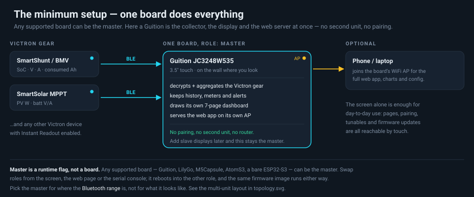
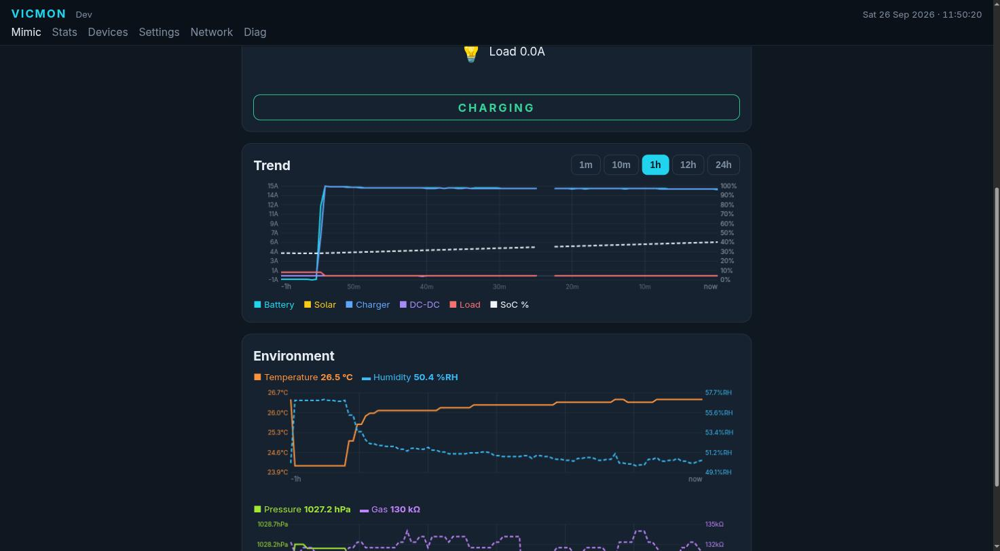
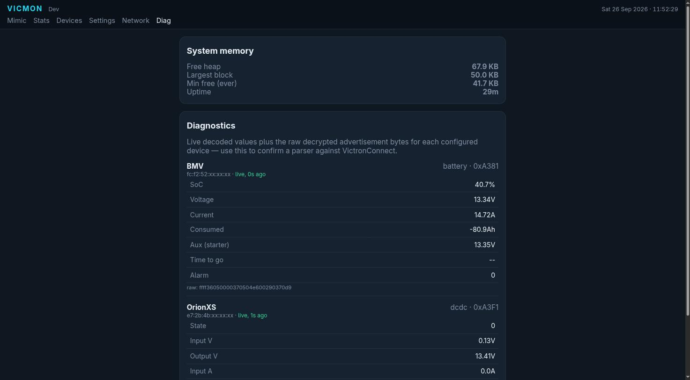

# How it fits together, and two example setups

## Start here: one board does everything

**Any supported board can be the master** — Guition, LilyGo, M5Capsule, AtomS3 or a
bare ESP32-S3. Master is a runtime flag, not a build or a board. The simplest useful
Vicmon is a single unit that collects, displays and serves the web app at once:

That is a complete system. No pairing, no second unit, no router. You add displays
later only because you want the numbers somewhere else in the vehicle — and when you
do, this board stays the master.

Pick whichever board suits **where the Bluetooth range is**, then decide separately
where you want screens.

## Scaling up: a collector plus displays

## The shape of it

One unit is the **collector (master)**. It is the only one that needs to be in
Bluetooth range of the Victron gear and the only one holding the encryption keys.
It decrypts, aggregates, keeps the history and the energy meters, raises the alerts,
and serves the web app.

Every other unit is a **slave display**. It holds no keys and talks to no Victron
device — it mirrors the master's snapshot over ESP-NOW and renders it locally. A
slave is not a dumb terminal: it has its own trend history (pulled from the master
on connect), its own WiFi AP and the full web app.

Because master/slave is a runtime flag, the same firmware is on all of them and any
board can be re-roled from its screen, its web page or the serial console. Nothing
about a board fixes its role: a Guition can be the master with a Capsule as a
headless slave just as readily as the other way round.

### What crosses each link

| Link | Direction | Carries |
|---|---|---|
| **BLE** | Victron → master | Encrypted "Instant Readout" advertisements. One-way broadcast; nothing connects. |
| **ESP-NOW snapshot** | master → slaves | Battery, sources, environment, alerts, clock and profile, every 250 ms. Sent to the broadcast address, so **there is no fixed limit on how many slaves** can listen. |
| **ESP-NOW history pull** | slave → master | On connect a slave asks for the trend backlog and fills its own rings, resumable, with a progress %. |
| **ESP-NOW firmware clone** | either way | Push or pull a whole firmware image between paired units. No cable. |
| **WiFi** | phone/laptop → any unit | Each unit runs its own AP and serves the whole web app from what it holds locally. |

Slaves filter on the master's **id**, so two Vicmon systems parked next to each other
never mix. Pairing is two-sided and deliberate — a window has to be open on both ends.

## Example: one collector, two displays

The deployment in the diagram, and a working configuration for it:

This is the author's own deployment — one of many possible shapes, not the required one:

| Unit | Board | Where | Role |
|---|---|---|---|
| Collector | **M5Capsule** | in the car, near the Victron gear | master — BLE, history, microSD log, RTC clock, buzzer, ENV Pro |
| Kitchen display | **Guition JC3248W535** | back of the ute / kitchen setup | slave — touch dashboard |
| Cabin display | **LilyGo T-Display-S3** | cabin | slave — two-button dashboard |

The Capsule is a good collector *here* precisely because it has no screen: it is
small, it runs off its internal battery through the power-hold pin, its RTC keeps the
clock without NTP, and its microSD holds the long history. The screens then go where
you actually look at them. Swap it around freely — put the Guition near the gear as
the master and the Capsule becomes an optional headless node, or drop the Capsule
entirely and let a display collect for itself.

### 1. Bring up the collector

1. Flash the universal image (see [DEPLOY.md](DEPLOY.md)) and power the board.
2. Join its AP — `Vicmon-XXXXXX` (last three MAC bytes), or a name you set — and
   open `http://192.168.4.1/`.
3. **Devices** → the Victron gear should be listed under *Discovered nearby*. Adopt
   each one and paste its encryption key from VictronConnect.

   
4. **Settings → System settings** → set the **battery capacity** in Ah. Nothing else
   knows it: it is not in the Victron advertisement, so remaining-Ah and time-to-go
   depend on you entering it.
5. **Settings → Panel signals** → bind the panel roles to device fields. With no dedicated
   AC charger or load shunt, bind *Charger* to **"Derived: charge unexplained by
   sources"** and *Load* to the derived load — otherwise charge that no source
   accounts for goes unattributed and the Week chart stays empty.
6. **Settings → Date & time** → set the clock once. On the Capsule it goes into the
   RTC and survives power loss, and the master broadcasts it to every slave.

   

   *Panel signals with the two derived bindings, and the battery capacity below them.*

### 2. Add each display

On the display board:

1. Flash the same image. It boots as a master by default, so switch it: **Network →
   System → Switch to Slave** (it reboots), or do it from the screen.
2. On the **master**: Network → System → **Pair a slave**. That opens a 60 s window.
   On the Capsule a short press of the side button does the same, and the LED flashes
   amber while the window is open.
3. On the **slave**: Network → System → **Pair to a master** (or the equivalent on
   its screen) while that window is open. A slave has no Devices/Settings/Diag pages
   — everything it owns lives on Network.
4. The slave starts showing live values within a second or two, then fills its Graph
   page from the master's backlog over the next few seconds.

Repeat for the second display. Nothing on the master needs to change — the snapshot
is a broadcast, so adding a display costs it nothing.

### 3. Keep it that way

- **Back up the config** — Network → Backup & restore → download the JSON. It holds every
  profile, device, key and binding. It is the only copy of your keys outside
  VictronConnect, and it is what lets you rebuild a unit in a minute.
- **Updating** — flash one unit, then push the firmware to the others over ESP-NOW
  (Network → System → *Send my firmware to the paired device*). No cable, no PC in
  the car. See [DEPLOY.md](DEPLOY.md).
- **Profiles** — if the same displays follow you between vehicles or a home setup,
  put each in its own profile and switch instantly rather than re-entering devices.

## Placement and range

BLE is the constraint, not ESP-NOW. Put the collector where it can hear the Victron
gear — same compartment if you can. ESP-NOW reaches considerably further and is what
crosses the vehicle to the displays.

If a slave shows **stale** it kept the last-known frame and is telling you the link
dropped, not that the numbers are wrong. If it shows the master as *foreign*, the two
are on different wire-protocol versions and need the same firmware.

## The web app

The same app is served by every unit, master or slave, from its own AP.

*Mimic — sources feeding the battery, the flow line animating in the direction of
charge, and the battery detail: voltage, current, watts, remaining Ah and the
time-to-full. The banner and the SoC fill take the charge-state colour.*

*Trend over the selected window with SoC on its own right-hand axis, and the
Environment pair beneath it — each pair shares a chart but not an axis.*

*Stats — net in/out amp-hours per scope, split by source, with per-scope resets.*

*Diag — live memory, then every configured device's decoded fields next to the raw
decrypted advertisement bytes. This is the page for confirming a parser against
VictronConnect.*

## Where things live in the web app

| Page | Cards |
|---|---|
| **/** Mimic | energy-flow dashboard, battery detail, trend chart, environment |
| **Devices** *(master only)* | Configured devices · Add device · Discovered nearby |
| **Stats** | Today / Trip / Total meters, last-7-days chart |
| **Settings** *(master only)* | Profiles · Panel signals · System settings (capacity, deadband, timezone) · Date & time · Alerts |
| **Network** *(both roles)* | System (pair, switch role, firmware clone) · Access point · Join a WiFi network · Firmware update (OTA) · Backup & restore |
| **Diag** *(master only)* | System memory · per-device decoded fields · raw decrypted advertisement bytes |
